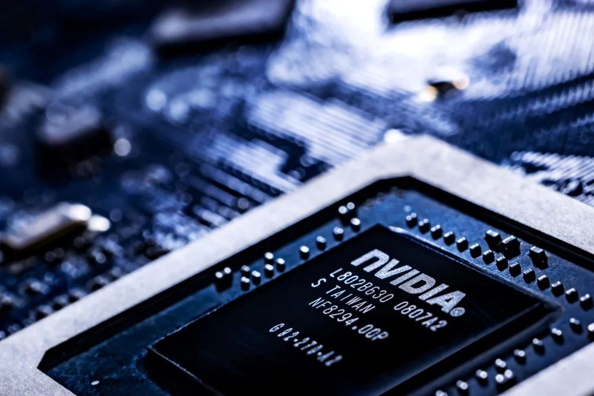
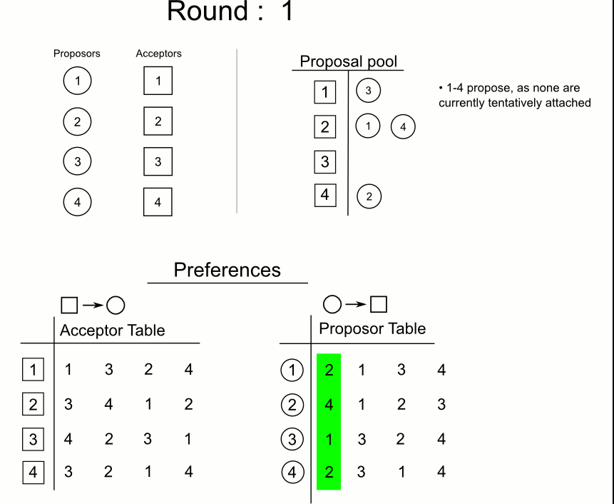
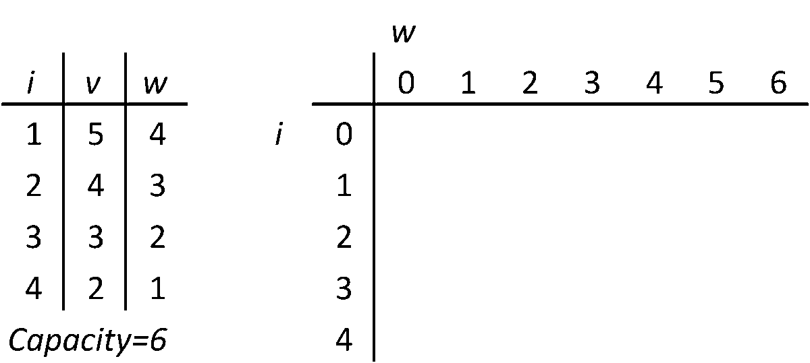
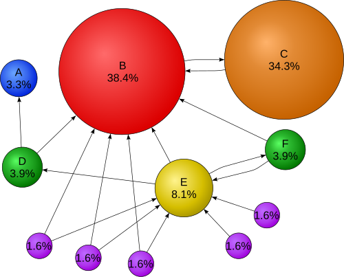
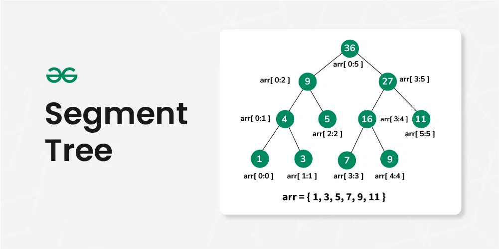
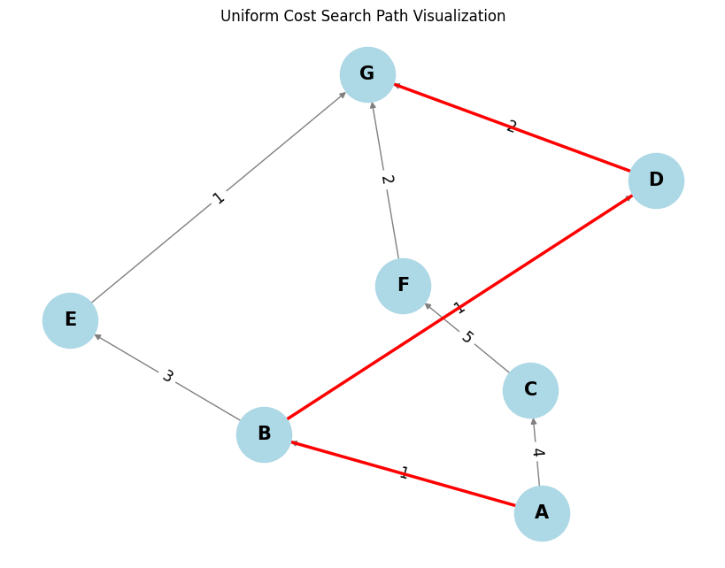
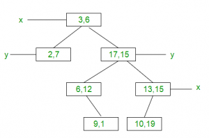
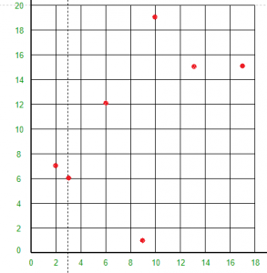

  Enabling Nvidia (En-vidia) - APS Portfolio

Enabling Nvidia (En-vidia)
==========================

An APS point of view

Course Name: Algorithmic Problem Solving

Course Code: 23ECSE309

Name: Amish Bhushan Kulkarni

Department: Electronics and Communications

Course Instructor: Prof. Prakash Hegade

KLE Technological University, Hubballi-31

Portfolio Topic/Domain: Nvidia

A deeper dive into Nvidia

### Contents

1.  [Introduction 🌱](#introduction)
2.  [Objectives 🎯](#objectives)
3.  [Ideas and Algorithms Used 💡](#Algorithms)
4.  [Business Use Cases ➡️ Algorithmic Solutions 🧩](#business)
5.  [Use Case Insights and Efficiency Metrics 📊](#metrics)
6.  [Key Learnings and Takeaways 🧠](#learnings)

### Introduction

Nvidia’s graphic processing unit (GPU) in Paris on Friday. Source: [NBC NEWS](https://www.nbcnews.com/business/business-news/what-is-nvidia-what-do-they-make-ai-artificial-intelligence-rcna140171)

Nvidia, a global leader in graphics processing technology and AI computing, has seen remarkable growth, with its market value nearing $3 trillion, making it one of the largest companies in the United States. Founded in 1993, Nvidia revolutionized the tech industry with its innovative GPUs, initially leading the gaming market. Today, its technology is essential for artificial intelligence, data centers, and automotive advancements, giving it a near-monopoly status in AI hardware. This transformation underscores Nvidia's critical role in shaping the future of technology, powered by platforms like CUDA and bolstered by exponential demand growth—especially during the pandemic boom \[1\] Understanding Nvidia’s vast ecosystem highlights how advanced hardware combined with algorithmic innovation drives performance and transforms experiences worldwide. Key areas of Nvidia's impact include:

#### Company Profile\[2\]

*   **Date:** 1993 – present
*   **Ticker:** NVDA
*   **Share price:** $131.29 (market close, May 23, 2025)
*   **Market cap:** $3.20 trillion
*   **Annual revenue:** $130.50 billion
*   **Earnings per share (prev. year):** $2.94
*   **Sector:** Information Technology
*   **Industry:** Semiconductors & Semiconductor Equipment
*   **CEO:** Mr. Jen-Hsun Huang
*   **Headquarters:** Santa Clara

### Key Products and AI Applications

*   **GeForce GTX and RTX series:** Used primarily in gaming and professional workstation applications.\[2\]
*   **NVIDIA A and H series and DGX systems:** Supports artificial intelligence (AI) and data center applications.\[2\]
*   **NVIDIA Tegra series:** Designed for small devices such as car components, smartphones, and handheld electronics.\[2\]
*   **NVIDIA Mellanox ConnectX SmartNICs and Quantum InfiniBand:** GPUs utilized in cloud applications, data storage, and machine learning.\[2\]
*   **CUDA, AI Enterprise, and Drive:** GPUs tailored for software developers (DRIVE being specifically designed for developers of self-driving car software).\[2\]
*   **NVIDIA Broadcast:** AI-powered app that transforms any room into a professional studio by enhancing audio and video quality with features like noise removal and virtual backgrounds \[3\].
*   **NVIDIA Clara:** AI platform accelerating healthcare breakthroughs in medical imaging, genomics, and drug discovery \[4\].
*   **NVIDIA Jetson:** AI edge computing platform consisting of a small form factor, high-performance build for IoT, robotics, and embedded systems, enabling real-time AI processing at the edge.\[5\]

### Enhancing Nvidia’s Capabilities with Algorithms

In today’s digital age, the efficiency and effectiveness of technology services can be significantly enhanced through the strategic application of data structures and algorithms. This portfolio project explores the core functionalities of Nvidia’s innovative platforms, applying the theoretical knowledge and practical skills acquired from the course Algorithmic Problem Solving (APS). By using advanced algorithmic techniques and innovative data structures, this project aims to propose solutions to real-world computational and AI challenges.

This portfolio demonstrates how algorithms can optimize Nvidia’s technologies. Each example illustrates how smart problem-solving with algorithms can enhance operational smoothness and processing power across edge computing, GPU acceleration, and AI-driven platforms. Join me in this exploration as we bridge the gap between theory and practice, highlighting the profound impact of data structures and algorithms on cutting-edge technologies. Additionally, each case includes a thorough performance analysis to evaluate effectiveness.

### Objectives 🎯

This portfolio focuses on applying core Data Structures and Algorithms (DSA) principles to real-world scenarios involving Nvidia technologies. The objectives include:

*   Apply graph algorithms to optimize data flow and interconnectivity in GPU architectures.
*   Use dynamic programming and greedy strategies to enhance memory management and caching efficiency in GPU-based computations.
*   Leverage search and sorting algorithms for efficient AI model inference and retrieval systems.
*   Utilize tree and heap structures to manage GPU resource allocation and priority scheduling tasks.
*   Implement hashing and prefix trees (tries) for fast data indexing and lookup in edge devices like Nvidia Jetson.

Ideas and Algorithms Used
-------------------------

*   [A\* Search](https://www.geeksforgeeks.org/a-search-algorithm/)
*   [Stable Marriage](https://www.geeksforgeeks.org/stable-marriage-problem/)
*   [Knapsack Problem](https://www.geeksforgeeks.org/0-1-knapsack-problem-dp-10/)
*   [PageRank Algorithm](https://en.wikipedia.org/wiki/PageRank)
*   [Segment Tree](https://www.geeksforgeeks.org/segment-tree-set-1-sum-of-given-range/)
*   [Uniform Cost Search](https://www.geeksforgeeks.org/uniform-cost-search-ucs-in-ai/)
*   [Kadane’s Algorithm](https://www.geeksforgeeks.org/largest-sum-contiguous-subarray/)
*   [Standard Deviation](https://en.wikipedia.org/wiki/Standard_deviation)

### 📈 Business Use Cases ➡️ Algorithmic Solutions 🧩

Nvidia’s business problems addressed here highlight the importance of algorithmic problem-solving:

#### 1\. Smart GPU Allocation using A\* Search & Stable Marriage 💡

Allocating the right task to the right GPU at the right time isn't just about maximizing value — it's also about matching compatibility and predicting the best long-term scheduling decisions. To tackle this, we combine two elegant algorithms: **A\* Search** (for optimal pathfinding) and the **Stable Marriage Problem** (for stable, preference-based matching).

##### What is A\* Search?

A\* (A-star) is a graph traversal algorithm that finds the shortest path between two nodes using both actual cost (g) and heuristic estimate (h), making it both optimal and complete. In our context, it's used to find the nearest or most optimal GPU given a task’s constraints (like current load, data location, energy cost, etc).

Source: [Wikipedia - A\* Search Algorithm](https://en.wikipedia.org/wiki/A*_search_algorithm)

###### Time & Space Complexity

*   **Time Complexity:** `O(E)` where `E` is the number of edges (can be exponential with bad heuristics)
*   **Space Complexity:** `O(V)` where `V` is the number of vertices

    // A* Search Algorithm in C++
    // A C++ Program to implement A* Search Algorithm
    #include 
    using namespace std;
    
    #define ROW 9
    #define COL 10
    
    // Creating a shortcut for int, int pair type
    typedef pair Pair;
    
    // Creating a shortcut for pair> type
    typedef pair > pPair;
    
    // A structure to hold the necessary parameters
    struct cell {
        // Row and Column index of its parent
        // Note that 0 <= i <= ROW-1 & 0 <= j <= COL-1
        int parent_i, parent_j;
        // f = g + h
        double f, g, h;
    };
    
    ...
    
    // A Utility Function to check whether given cell (row, col)
    // is a valid cell or not.
    bool isValid(int row, int col)
    {
        // Returns true if row number and column number
        // is in range
        return (row >= 0) && (row < ROW) && (col >= 0)
               && (col < COL);
    }
    
    // A Utility Function to check whether the given cell is
    // blocked or not
    bool isUnBlocked(int grid[][COL], int row, int col)
    {
        // Returns true if the cell is not blocked else false
        if (grid[row][col] == 1)
            return (true);
        else
            return (false);
    }
    
    // A Utility Function to check whether destination cell has
    // been reached or not
    bool isDestination(int row, int col, Pair dest)
    {
        if (row == dest.first && col == dest.second)
            return (true);
        else
            return (false);
    }
    
    // A Utility Function to calculate the 'h' heuristics.
    double calculateHValue(int row, int col, Pair dest)
    {
        // Return using the distance formula
        return ((double)sqrt(
            (row - dest.first) * (row - dest.first)
            + (col - dest.second) * (col - dest.second)));
    }
    
    // A Utility Function to trace the path from the source
    // to destination
    void tracePath(cell cellDetails[][COL], Pair dest)
    {
        printf("\nThe Path is ");
        int row = dest.first;
        int col = dest.second;
    
        stack Path;
    
        while (!(cellDetails[row][col].parent_i == row
                 && cellDetails[row][col].parent_j == col)) {
            Path.push(make_pair(row, col));
            int temp_row = cellDetails[row][col].parent_i;
            int temp_col = cellDetails[row][col].parent_j;
            row = temp_row;
            col = temp_col;
        }
    
        Path.push(make_pair(row, col));
        while (!Path.empty()) {
            pair p = Path.top();
            Path.pop();
            printf("-> (%d,%d) ", p.first, p.second);
        }
    
        return;
    }
    
    // A Function to find the shortest path between
    // a given source cell to a destination cell according
    // to A* Search Algorithm
    void aStarSearch(int grid[][COL], Pair src, Pair dest)
    {
        // If the source is out of range
        if (isValid(src.first, src.second) == false) {
            printf("Source is invalid\n");
            return;
        }
    
        // If the destination is out of range
        if (isValid(dest.first, dest.second) == false) {
            printf("Destination is invalid\n");
            return;
        }
    
        // Either the source or the destination is blocked
        if (isUnBlocked(grid, src.first, src.second) == false
            || isUnBlocked(grid, dest.first, dest.second)
                   == false) {
            printf("Source or the destination is blocked\n");
            return;
        }
    
        // If the destination cell is the same as source cell
        if (isDestination(src.first, src.second, dest)
            == true) {
            printf("We are already at the destination\n");
            return;
        }
    
        // Create a closed list and initialise it to false which
        // means that no cell has been included yet This closed
        // list is implemented as a boolean 2D array
        bool closedList[ROW][COL];
        memset(closedList, false, sizeof(closedList));
    
        // Declare a 2D array of structure to hold the details
        // of that cell
        cell cellDetails[ROW][COL];
    
        int i, j;
    
        for (i = 0; i < ROW; i++) {
            for (j = 0; j < COL; j++) {
                cellDetails[i][j].f = FLT_MAX;
                cellDetails[i][j].g = FLT_MAX;
                cellDetails[i][j].h = FLT_MAX;
                cellDetails[i][j].parent_i = -1;
                cellDetails[i][j].parent_j = -1;
            }
        }
    
        // Initialising the parameters of the starting node
        i = src.first, j = src.second;
        cellDetails[i][j].f = 0.0;
        cellDetails[i][j].g = 0.0;
        cellDetails[i][j].h = 0.0;
        cellDetails[i][j].parent_i = i;
        cellDetails[i][j].parent_j = j;
    
        /*
         Create an open list having information as-
         >
         where f = g + h,
         and i, j are the row and column index of that cell
         Note that 0 <= i <= ROW-1 & 0 <= j <= COL-1
         This open list is implemented as a set of pair of
         pair.*/
        set openList;
    
        // Put the starting cell on the open list and set its
        // 'f' as 0
        openList.insert(make_pair(0.0, make_pair(i, j)));
    
        // We set this boolean value as false as initially
        // the destination is not reached.
        bool foundDest = false;
    
        while (!openList.empty()) {
            pPair p = *openList.begin();
    
            // Remove this vertex from the open list
            openList.erase(openList.begin());
    
            // Add this vertex to the closed list
            i = p.second.first;
            j = p.second.second;
            closedList[i][j] = true;
    
            /*
             Generating all the 8 successor of this cell
    
                 N.W   N   N.E
                   \   |   /
                    \  |  /
                 W----Cell----E
                      / | \
                    /   |  \
                 S.W    S   S.E
    
             Cell-->Popped Cell (i, j)
             N -->  North       (i-1, j)
             S -->  South       (i+1, j)
             E -->  East        (i, j+1)
             W -->  West           (i, j-1)
             N.E--> North-East  (i-1, j+1)
             N.W--> North-West  (i-1, j-1)
             S.E--> South-East  (i+1, j+1)
             S.W--> South-West  (i+1, j-1)*/
    
            // To store the 'g', 'h' and 'f' of the 8 successors
            double gNew, hNew, fNew;
    
            //----------- 1st Successor (North) ------------
    
            // Only process this cell if this is a valid one
            if (isValid(i - 1, j) == true) {
                // If the destination cell is the same as the
                // current successor
                if (isDestination(i - 1, j, dest) == true) {
                    // Set the Parent of the destination cell
                    cellDetails[i - 1][j].parent_i = i;
                    cellDetails[i - 1][j].parent_j = j;
                    printf("The destination cell is found\n");
                    tracePath(cellDetails, dest);
                    foundDest = true;
                    return;
                }
                // If the successor is already on the closed
                // list or if it is blocked, then ignore it.
                // Else do the following
                else if (closedList[i - 1][j] == false
                         && isUnBlocked(grid, i - 1, j)
                                == true) {
                    gNew = cellDetails[i][j].g + 1.0;
                    hNew = calculateHValue(i - 1, j, dest);
                    fNew = gNew + hNew;
    
                    // If it isn’t on the open list, add it to
                    // the open list. Make the current square
                    // the parent of this square. Record the
                    // f, g, and h costs of the square cell
                    //                OR
                    // If it is on the open list already, check
                    // to see if this path to that square is
                    // better, using 'f' cost as the measure.
                    if (cellDetails[i - 1][j].f == FLT_MAX
                        || cellDetails[i - 1][j].f > fNew) {
                        openList.insert(make_pair(
                            fNew, make_pair(i - 1, j)));
    
                        // Update the details of this cell
                        cellDetails[i - 1][j].f = fNew;
                        cellDetails[i - 1][j].g = gNew;
                        cellDetails[i - 1][j].h = hNew;
                        cellDetails[i - 1][j].parent_i = i;
                        cellDetails[i - 1][j].parent_j = j;
                    }
                }
            }
    
            //----------- 2nd Successor (South) ------------
    
            // Only process this cell if this is a valid one
            if (isValid(i + 1, j) == true) {
                // If the destination cell is the same as the
                // current successor
                if (isDestination(i + 1, j, dest) == true) {
                    // Set the Parent of the destination cell
                    cellDetails[i + 1][j].parent_i = i;
                    cellDetails[i + 1][j].parent_j = j;
                    printf("The destination cell is found\n");
                    tracePath(cellDetails, dest);
                    foundDest = true;
                    return;
                }
                // If the successor is already on the closed
                // list or if it is blocked, then ignore it.
                // Else do the following
                else if (closedList[i + 1][j] == false
                         && isUnBlocked(grid, i + 1, j)
                                == true) {
                    gNew = cellDetails[i][j].g + 1.0;
                    hNew = calculateHValue(i + 1, j, dest);
                    fNew = gNew + hNew;
    
                    // If it isn’t on the open list, add it to
                    // the open list. Make the current square
                    // the parent of this square. Record the
                    // f, g, and h costs of the square cell
                    //                OR
                    // If it is on the open list already, check
                    // to see if this path to that square is
                    // better, using 'f' cost as the measure.
                    if (cellDetails[i + 1][j].f == FLT_MAX
                        || cellDetails[i + 1][j].f > fNew) {
                        openList.insert(make_pair(
                            fNew, make_pair(i + 1, j)));
                        // Update the details of this cell
                        cellDetails[i + 1][j].f = fNew;
                        cellDetails[i + 1][j].g = gNew;
                        cellDetails[i + 1][j].h = hNew;
                        cellDetails[i + 1][j].parent_i = i;
                        cellDetails[i + 1][j].parent_j = j;
                    }
                }
            }
    
            //----------- 3rd Successor (East) ------------
    
            // Only process this cell if this is a valid one
            if (isValid(i, j + 1) == true) {
                // If the destination cell is the same as the
                // current successor
                if (isDestination(i, j + 1, dest) == true) {
                    // Set the Parent of the destination cell
                    cellDetails[i][j + 1].parent_i = i;
                    cellDetails[i][j + 1].parent_j = j;
                    printf("The destination cell is found\n");
                    tracePath(cellDetails, dest);
                    foundDest = true;
                    return;
                }
    
                // If the successor is already on the closed
                // list or if it is blocked, then ignore it.
                // Else do the following
                else if (closedList[i][j + 1] == false
                         && isUnBlocked(grid, i, j + 1)
                                == true) {
                    gNew = cellDetails[i][j].g + 1.0;
                    hNew = calculateHValue(i, j + 1, dest);
                    fNew = gNew + hNew;
    
                    // If it isn’t on the open list, add it to
                    // the open list. Make the current square
                    // the parent of this square. Record the
                    // f, g, and h costs of the square cell
                    //                OR
                    // If it is on the open list already, check
                    // to see if this path to that square is
                    // better, using 'f' cost as the measure.
                    if (cellDetails[i][j + 1].f == FLT_MAX
                        || cellDetails[i][j + 1].f > fNew) {
                        openList.insert(make_pair(
                            fNew, make_pair(i, j + 1)));
    
                        // Update the details of this cell
                        cellDetails[i][j + 1].f = fNew;
                        cellDetails[i][j + 1].g = gNew;
                        cellDetails[i][j + 1].h = hNew;
                        cellDetails[i][j + 1].parent_i = i;
                        cellDetails[i][j + 1].parent_j = j;
                    }
                }
            }
    
            //----------- 4th Successor (West) ------------
    
            // Only process this cell if this is a valid one
            if (isValid(i, j - 1) == true) {
                // If the destination cell is the same as the
                // current successor
                if (isDestination(i, j - 1, dest) == true) {
                    // Set the Parent of the destination cell
                    cellDetails[i][j - 1].parent_i = i;
                    cellDetails[i][j - 1].parent_j = j;
                    printf("The destination cell is found\n");
                    tracePath(cellDetails, dest);
                    foundDest = true;
                    return;
                }
    
                // If the successor is already on the closed
                // list or if it is blocked, then ignore it.
                // Else do the following
                else if (closedList[i][j - 1] == false
                         && isUnBlocked(grid, i, j - 1)
                                == true) {
                    gNew = cellDetails[i][j].g + 1.0;
                    hNew = calculateHValue(i, j - 1, dest);
                    fNew = gNew + hNew;
    
                    // If it isn’t on the open list, add it to
                    // the open list. Make the current square
                    // the parent of this square. Record the
                    // f, g, and h costs of the square cell
                    //                OR
                    // If it is on the open list already, check
                    // to see if this path to that square is
                    // better, using 'f' cost as the measure.
                    if (cellDetails[i][j - 1].f == FLT_MAX
                        || cellDetails[i][j - 1].f > fNew) {
                        openList.insert(make_pair(
                            fNew, make_pair(i, j - 1)));
    
                        // Update the details of this cell
                        cellDetails[i][j - 1].f = fNew;
                        cellDetails[i][j - 1].g = gNew;
                        cellDetails[i][j - 1].h = hNew;
                        cellDetails[i][j - 1].parent_i = i;
                        cellDetails[i][j - 1].parent_j = j;
                    }
                }
            }
    
            //----------- 5th Successor (North-East)
            //------------
    
            // Only process this cell if this is a valid one
            if (isValid(i - 1, j + 1) == true) {
                // If the destination cell is the same as the
                // current successor
                if (isDestination(i - 1, j + 1, dest) == true) {
                    // Set the Parent of the destination cell
                    cellDetails[i - 1][j + 1].parent_i = i;
                    cellDetails[i - 1][j + 1].parent_j = j;
                    printf("The destination cell is found\n");
                    tracePath(cellDetails, dest);
                    foundDest = true;
                    return;
                }
    
                // If the successor is already on the closed
                // list or if it is blocked, then ignore it.
                // Else do the following
                else if (closedList[i - 1][j + 1] == false
                         && isUnBlocked(grid, i - 1, j + 1)
                                == true) {
                    gNew = cellDetails[i][j].g + 1.414;
                    hNew = calculateHValue(i - 1, j + 1, dest);
                    fNew = gNew + hNew;
    
                    // If it isn’t on the open list, add it to
                    // the open list. Make the current square
                    // the parent of this square. Record the
                    // f, g, and h costs of the square cell
                    //                OR
                    // If it is on the open list already, check
                    // to see if this path to that square is
                    // better, using 'f' cost as the measure.
                    if (cellDetails[i - 1][j + 1].f == FLT_MAX
                        || cellDetails[i - 1][j + 1].f > fNew) {
                        openList.insert(make_pair(
                            fNew, make_pair(i - 1, j + 1)));
    
                        // Update the details of this cell
                        cellDetails[i - 1][j + 1].f = fNew;
                        cellDetails[i - 1][j + 1].g = gNew;
                        cellDetails[i - 1][j + 1].h = hNew;
                        cellDetails[i - 1][j + 1].parent_i = i;
                        cellDetails[i - 1][j + 1].parent_j = j;
                    }
                }
            }
    
            //----------- 6th Successor (North-West)
            //------------
    
            // Only process this cell if this is a valid one
            if (isValid(i - 1, j - 1) == true) {
                // If the destination cell is the same as the
                // current successor
                if (isDestination(i - 1, j - 1, dest) == true) {
                    // Set the Parent of the destination cell
                    cellDetails[i - 1][j - 1].parent_i = i;
                    cellDetails[i - 1][j - 1].parent_j = j;
                    printf("The destination cell is found\n");
                    tracePath(cellDetails, dest);
                    foundDest = true;
                    return;
                }
    
                // If the successor is already on the closed
                // list or if it is blocked, then ignore it.
                // Else do the following
                else if (closedList[i - 1][j - 1] == false
                         && isUnBlocked(grid, i - 1, j - 1)
                                == true) {
                    gNew = cellDetails[i][j].g + 1.414;
                    hNew = calculateHValue(i - 1, j - 1, dest);
                    fNew = gNew + hNew;
    
                    // If it isn’t on the open list, add it to
                    // the open list. Make the current square
                    // the parent of this square. Record the
                    // f, g, and h costs of the square cell
                    //                OR
                    // If it is on the open list already, check
                    // to see if this path to that square is
                    // better, using 'f' cost as the measure.
                    if (cellDetails[i - 1][j - 1].f == FLT_MAX
                        || cellDetails[i - 1][j - 1].f > fNew) {
                        openList.insert(make_pair(
                            fNew, make_pair(i - 1, j - 1)));
                        // Update the details of this cell
                        cellDetails[i - 1][j - 1].f = fNew;
                        cellDetails[i - 1][j - 1].g = gNew;
                        cellDetails[i - 1][j - 1].h = hNew;
                        cellDetails[i - 1][j - 1].parent_i = i;
                        cellDetails[i - 1][j - 1].parent_j = j;
                    }
                }
            }
    
            //----------- 7th Successor (South-East)
            //------------
    
            // Only process this cell if this is a valid one
            if (isValid(i + 1, j + 1) == true) {
                // If the destination cell is the same as the
                // current successor
                if (isDestination(i + 1, j + 1, dest) == true) {
                    // Set the Parent of the destination cell
                    cellDetails[i + 1][j + 1].parent_i = i;
                    cellDetails[i + 1][j + 1].parent_j = j;
                    printf("The destination cell is found\n");
                    tracePath(cellDetails, dest);
                    foundDest = true;
                    return;
                }
    
                // If the successor is already on the closed
                // list or if it is blocked, then ignore it.
                // Else do the following
                else if (closedList[i + 1][j + 1] == false
                         && isUnBlocked(grid, i + 1, j + 1)
                                == true) {
                    gNew = cellDetails[i][j].g + 1.414;
                    hNew = calculateHValue(i + 1, j + 1, dest);
                    fNew = gNew + hNew;
    
                    // If it isn’t on the open list, add it to
                    // the open list. Make the current square
                    // the parent of this square. Record the
                    // f, g, and h costs of the square cell
                    //                OR
                    // If it is on the open list already, check
                    // to see if this path to that square is
                    // better, using 'f' cost as the measure.
                    if (cellDetails[i + 1][j + 1].f == FLT_MAX
                        || cellDetails[i + 1][j + 1].f > fNew) {
                        openList.insert(make_pair(
                            fNew, make_pair(i + 1, j + 1)));
    
                        // Update the details of this cell
                        cellDetails[i + 1][j + 1].f = fNew;
                        cellDetails[i + 1][j + 1].g = gNew;
                        cellDetails[i + 1][j + 1].h = hNew;
                        cellDetails[i + 1][j + 1].parent_i = i;
                        cellDetails[i + 1][j + 1].parent_j = j;
                    }
                }
            }
    
            //----------- 8th Successor (South-West)
            //------------
    
            // Only process this cell if this is a valid one
            if (isValid(i + 1, j - 1) == true) {
                // If the destination cell is the same as the
                // current successor
                if (isDestination(i + 1, j - 1, dest) == true) {
                    // Set the Parent of the destination cell
                    cellDetails[i + 1][j - 1].parent_i = i;
                    cellDetails[i + 1][j - 1].parent_j = j;
                    printf("The destination cell is found\n");
                    tracePath(cellDetails, dest);
                    foundDest = true;
                    return;
                }
    
                // If the successor is already on the closed
                // list or if it is blocked, then ignore it.
                // Else do the following
                else if (closedList[i + 1][j - 1] == false
                         && isUnBlocked(grid, i + 1, j - 1)
                                == true) {
                    gNew = cellDetails[i][j].g + 1.414;
                    hNew = calculateHValue(i + 1, j - 1, dest);
                    fNew = gNew + hNew;
    
                    // If it isn’t on the open list, add it to
                    // the open list. Make the current square
                    // the parent of this square. Record the
                    // f, g, and h costs of the square cell
                    //                OR
                    // If it is on the open list already, check
                    // to see if this path to that square is
                    // better, using 'f' cost as the measure.
                    if (cellDetails[i + 1][j - 1].f == FLT_MAX
                        || cellDetails[i + 1][j - 1].f > fNew) {
                        openList.insert(make_pair(
                            fNew, make_pair(i + 1, j - 1)));
    
                        // Update the details of this cell
                        cellDetails[i + 1][j - 1].f = fNew;
                        cellDetails[i + 1][j - 1].g = gNew;
                        cellDetails[i + 1][j - 1].h = hNew;
                        cellDetails[i + 1][j - 1].parent_i = i;
                        cellDetails[i + 1][j - 1].parent_j = j;
                    }
                }
            }
        }
    
        // When the destination cell is not found and the open
        // list is empty, then we conclude that we failed to
        // reach the destination cell. This may happen when the
        // there is no way to destination cell (due to
        // blockages)
        if (foundDest == false)
            printf("Failed to find the Destination Cell\n");
    
        return;
    }
    
    // Driver program to test above function
    int main()
    {
        /* Description of the Grid-
         1--> The cell is not blocked
         0--> The cell is blocked    */
        int grid[ROW][COL]
            = { { 1, 0, 1, 1, 1, 1, 0, 1, 1, 1 },
                { 1, 1, 1, 0, 1, 1, 1, 0, 1, 1 },
                { 1, 1, 1, 0, 1, 1, 0, 1, 0, 1 },
                { 0, 0, 1, 0, 1, 0, 0, 0, 0, 1 },
                { 1, 1, 1, 0, 1, 1, 1, 0, 1, 0 },
                { 1, 0, 1, 1, 1, 1, 0, 1, 0, 0 },
                { 1, 0, 0, 0, 0, 1, 0, 0, 0, 1 },
                { 1, 0, 1, 1, 1, 1, 0, 1, 1, 1 },
                { 1, 1, 1, 0, 0, 0, 1, 0, 0, 1 } };
    
        // Source is the left-most bottom-most corner
        Pair src = make_pair(8, 0);
    
        // Destination is the left-most top-most corner
        Pair dest = make_pair(0, 0);
    
        aStarSearch(grid, src, dest);
    
        return (0);
    }
    
    

Show More function toggleMore() { var dots = document.getElementById("dots"); var moreText = document.getElementById("more"); var btnText = event.target; if (dots.style.display === "none") { dots.style.display = "inline"; btnText.innerHTML = "Show More"; moreText.style.display = "none"; } else { dots.style.display = "none"; btnText.innerHTML = "Show Less"; moreText.style.display = "inline"; } }

**Source:** [GeeksforGeeks - A\* Search Algorithm \[6\]](https://www.geeksforgeeks.org/a-search-algorithm/)

##### What is the Stable Marriage Problem?

The Stable Marriage Problem finds a stable matching between two equally sized sets of elements given ranked preferences. In GPU scheduling, tasks and GPUs each have preferences (based on priority, load, or locality). The goal is to match them so that no task-GPU pair would rather be with each other over their current assignments.

Source: [Wikipedia - Stable Matching Problem](https://en.wikipedia.org/wiki/Stable_matching_problem)

###### Time & Space Complexity

*   **Time Complexity:** `O(n2)`
*   **Space Complexity:** `O(n2)`

    // Gale-Shapley Algorithm (Stable Marriage) in C++
    #include 
    using namespace std;
    
    // Checks if woman 'w' prefers 'm1' over 'm'
    bool wPrefersM1OverM(vector> &prefer, int w, int m, int m1)
    {
        int N = prefer[0].size();
        for (int i = 0; i < N; i++)
        {
            // If m1 comes before m, w prefers
            // her current engagement
            if (prefer[w][i] == m1)
                return true;
    
            // If m comes before m1, w prefers m
            if (prefer[w][i] == m)
                return false;
        }
    }
    
    // Implements the stable marriage algorithm
    vector stableMarriage(vector> &prefer)
    {
        int N = prefer[0].size();
    
        // Stores women's partners
        vector wPartner(N, -1);
    
        // Tracks free men
        vector mFree(N, false);
        int freeCount = N;
    
        while (freeCount > 0)
        {
            int m;
            for (m = 0; m < N; m++)
                if (!mFree[m])
                    break;
    
            // Process each woman in m's preference list
            for (int i = 0; i < N && !mFree[m]; i++)
            {
                int w = prefer[m][i];
                if (wPartner[w - N] == -1)
                {
                    // Engage m and w if w is free
                    wPartner[w - N] = m;
                    mFree[m] = true;
                    freeCount--;
                }
                else
                {
                    int m1 = wPartner[w - N];
                    // If w prefers m over her current partner, reassign
                    if (!wPrefersM1OverM(prefer, w, m, m1))
                    {
                        wPartner[w - N] = m;
                        mFree[m] = true;
                        mFree[m1] = false;
                    }
                }
            }
        }
        return wPartner;
    }
    
    int main()
    {
        vector> prefer = {
            {7, 5, 6, 4}, {5, 4, 6, 7}, {4, 5, 6, 7}, {4, 5, 6, 7},
            {0, 1, 2, 3}, {0, 1, 2, 3}, {0, 1, 2, 3}, {0, 1, 2, 3},
        };
    
        vector wPartner = stableMarriage(prefer);
        cout << "Woman   Man" << endl;
        int N = prefer[0].size();
        for (int i = 0; i < N; i++)
            cout << " " << i + N << "\t\t" << wPartner[i] << endl;
        return 0;
    }
    

##### GPU Task Scheduling using A\* + Stable Matching

Combining A\* with Stable Marriage offers a dual-layer strategy: A\* is used to find the nearest or most optimal GPU candidates, and Stable Marriage then ensures fair and stable matching among those candidates and tasks based on mutual preferences. This hybrid strategy reduces bottlenecks and increases GPU utilization fairness in a dynamic environment.

##### Benefits of this approach

*   Provides stable long-term GPU-task assignments without ping-ponging.
*   Reduces search space by pruning suboptimal GPUs via A\* heuristic.
*   Ideal for clustered or distributed GPU farms with latency or bandwidth constraints.
*   Balances local GPU availability and global task priority intelligently.

This approach is particularly useful in edge AI deployment, multi-GPU servers, and AI training farms where fair, efficient, and low-latency scheduling is crucial. Nvidia’s advanced datacenter schedulers often employ similar hybrid models under the hood for performance-aware matching.

#### 2\. GPU Resource Management 🎮

Efficiently assigning tasks across available GPUs in data centers is crucial for maximizing throughput while minimizing energy use and latency. This becomes especially important when multiple AI tasks with different resource requirements are queued together.

**Applied Algorithm:** 0/1 Knapsack Problem – where each job is an item with weight (GPU usage) and value (priority or expected reward).

##### What is the Knapsack Problem?

The Knapsack Problem is a classic optimization problem. Given a set of items, each with a weight and value, the goal is to select items so that the total weight does not exceed a capacity limit while maximizing the total value. In the 0/1 Knapsack variant, items cannot be split — they are either taken or left.

Source: [Wikimedia Commons](https://commons.wikimedia.org/wiki/File:Knapsack_problem_dynamic_programming.gif)

###### Time & Space Complexity

*   **Time Complexity:** `O(nW)` — where `n` is the number of items and `W` is the total capacity of the knapsack.
*   **Space Complexity:** `O(nW)` using a 2D DP array, or `O(W)` using a space-optimized 1D array.

While the knapsack problem is NP-complete, dynamic programming offers a pseudo-polynomial time solution that is efficient for moderate-sized inputs. Space optimization further enables real-time applications in resource-constrained environments like embedded GPU systems.

    // 0/1 Knapsack Problem in C++ (Dynamic Programming)
    
    #include <iostream>
    #include <vector>
    using namespace std;
    
    int knapsack(const vector<int>& weights, const vector<int>& values, int capacity) {
        int n = weights.size();
        vector<vector<int>> dp(n + 1, vector<int>(capacity + 1, 0));
    
        for (int i = 1; i <= n; ++i) {
            for (int w = 0; w <= capacity; ++w) {
                if (weights[i - 1] <= w) {
                    dp[i][w] = max(values[i - 1] + dp[i - 1][w - weights[i - 1]], dp[i - 1][w]);
                } else {
                    dp[i][w] = dp[i - 1][w];
                }
            }
        }
    
        return dp[n][capacity];
    }
    
    int main() {
        vector<int> weights = {2, 1, 3, 2};
        vector<int> values = {12, 10, 20, 15};
        int capacity = 5;
    
        cout << "Maximum value: " << knapsack(weights, values, capacity) << endl; // Output: 37
        return 0;
    }
      

##### GPU Resource Management as a Knapsack Problem

Nvidia GPUs in data centers must run multiple AI workloads simultaneously. Each task requires some GPU memory and compute, and has a priority or value. Since GPU resources are limited, scheduling becomes a problem of selecting tasks that maximize total priority without exceeding resource limits — exactly like a 0/1 Knapsack Problem.

The goal is to select tasks fitting within a 16 GB GPU memory limit to maximize total priority, ensuring efficient GPU utilization and balanced workload scheduling.

##### Benefits of this approach

*   Maximizes GPU resource utilization without overcommitment.
*   Enables automated scheduling of high-priority AI workloads.
*   Balances throughput and performance priorities dynamically.
*   Supports real-time scheduling as workloads change.

This knapsack-based scheduling logic underpins Nvidia’s CUDA Multi-Process Service (MPS) and cloud GPU schedulers to optimize resource allocation dynamically across many clients and workloads.

#### 3\. Real-Time Recommendation Rankings 🎯

Delivering personalized, real-time recommendations is vital for engagement across platforms like streaming, retail, and gaming. NVIDIA Merlin leverages massive GPU power to process billions of interactions per second — but ranking those results meaningfully is the real challenge.

**Applied Algorithm:** PageRank – leveraging graph-based influence propagation for ranking user-item interaction networks.

##### What is the PageRank Algorithm?

PageRank is a graph-based algorithm that assigns importance to nodes based on their connectivity. Originally designed for ranking web pages, it models a "random surfer" who follows links. A node’s rank is determined by how many important nodes link to it, recursively. This makes it ideal for influence-based ranking in recommendation systems.

Source: [Wikipedia - Page Rank](https://en.wikipedia.org/wiki/PageRank)

###### Time & Space Complexity

*   **Time Complexity:** `O(KN)` — where `K` is the number of iterations and `N` is the number of edges in the graph.
*   **Space Complexity:** `O(V)` — where `V` is the number of nodes (users + items).

Thanks to its iterative nature, PageRank maps perfectly to CUDA for parallel GPU execution — enabling fast updates in dynamic graphs as user interactions stream in.

    // Simplified PageRank implementation (Python-like pseudocode)
    
    def pagerank(graph, damping=0.85, iterations=10):
        N = len(graph)
        ranks = {node: 1/N for node in graph}
    
        for _ in range(iterations):
            new_ranks = {}
            for node in graph:
                total = sum(ranks[neigh] / len(graph[neigh]) for neigh in graph if node in graph[neigh])
                new_ranks[node] = (1 - damping) / N + damping * total
            ranks = new_ranks
    
        return ranks

##### Why PageRank for NVIDIA Merlin?

In real-time recommendation engines, users and items form a bipartite graph where interaction strength matters. PageRank naturally identifies influential items through indirect relationships — e.g., "users like me also viewed this" — providing context-aware ranking.

These weighted edges form a graph input to PageRank, producing global rankings that reflect not just direct popularity, but contextual influence from similar users and indirect interaction paths.

##### Benefits of this approach

*   Improves ranking relevance via indirect interaction paths.
*   Enables real-time updates using CUDA-based parallelism.
*   Resilient to spam or click-fraud (due to dampening factor).
*   Supports graph embeddings and hybrid models in NVIDIA Merlin.

PageRank-based ranking enhances NVIDIA Merlin’s RecSys stack by providing stable, explainable recommendations that scale with GPU performance — optimizing both accuracy and latency in production environments.

#### 4\. GPU Memory Management Optimization 🧠

Efficient and dynamic management of GPU memory is critical in maximizing the throughput of AI workloads. With multiple simultaneous tasks allocating and freeing memory blocks, fragmentation and slow allocation can degrade performance. Segment Trees enable real-time tracking and querying of memory intervals to optimize allocation and minimize fragmentation.

**Applied Algorithm:** Segment Tree – a data structure optimized for interval queries and updates.

##### What is a Segment Tree?

A Segment Tree is a binary tree data structure that allows efficient querying and updating over intervals or segments of an array. It supports operations like finding minimum, maximum, or sum within a range in `O(log n)` time, making it well-suited for dynamic interval management problems such as GPU memory allocation.

Source: [GeeksforGeeks\[7\]](https://www.geeksforgeeks.org/segment-tree-data-structure/)

###### Time & Space Complexity

*   **Time Complexity:** `O(log n)` per query or update, where `n` is the size of the memory address space.
*   **Space Complexity:** `O(n)` to store the segment tree.

This efficiency allows real-time memory management in GPUs, enabling fast allocation and deallocation with minimal overhead even under heavy multitasking scenarios.

    // Simplified Segment Tree for GPU Memory Allocation in C++
    
    #include <iostream>
    #include <vector>
    using namespace std;
    
    class SegmentTree {
        vector<int> tree;
        int size;
    
    public:
        SegmentTree(int n) {
            size = n;
            tree.assign(4 * n, 0);  // Store free/used status of segments
        }
    
        void update(int idx, int start, int end, int pos, int val) {
            if (start == end) {
                tree[idx] = val;
                return;
            }
            int mid = (start + end) / 2;
            if (pos <= mid)
                update(2 * idx + 1, start, mid, pos, val);
            else
                update(2 * idx + 2, mid + 1, end, pos, val);
    
            tree[idx] = tree[2 * idx + 1] + tree[2 * idx + 2];
        }
    
        int query(int idx, int start, int end, int l, int r) {
            if (r < start || l > end)
                return 0;
            if (l <= start && end <= r)
                return tree[idx];
            int mid = (start + end) / 2;
            return query(2 * idx + 1, start, mid, l, r) + query(2 * idx + 2, mid + 1, end, l, r);
        }
    };
    
    int main() {
        int memorySize = 16;  // 16 GB GPU memory blocks
        SegmentTree segTree(memorySize);
    
        // Allocate memory at block 3
        segTree.update(0, 0, memorySize - 1, 3, 1);
    
        // Query how many blocks are allocated between 0 and 7
        cout << "Allocated blocks in range [0,7]: " << segTree.query(0, 0, memorySize - 1, 0, 7) << endl;
    
        return 0;
    }
        

##### Applying Segment Trees to NVIDIA GPU Memory Management

NVIDIA GPUs run multiple AI workloads that continuously allocate and release memory. Tracking free and used memory blocks efficiently is essential to prevent fragmentation and optimize performance. Segment Trees allow the memory manager to:

*   Quickly query available free memory intervals for allocation requests.
*   Update memory usage status dynamically as workloads start and finish.
*   Minimize fragmentation by merging adjacent free blocks in real-time.
*   Support concurrent memory management operations in parallel on CUDA cores.

##### Benefits of this approach

*   Enables high throughput for AI training and inference by reducing memory allocation overhead.
*   Improves stability and reduces out-of-memory errors during dynamic workload changes.
*   Facilitates scalable memory management in multi-tenant GPU clusters.
*   Integrates seamlessly with NVIDIA’s CUDA runtime and driver-level memory allocators.

This segment tree-based memory optimization is foundational for NVIDIA’s AI platforms to maintain efficient GPU utilization and deliver consistent high performance under heavy multitasking scenarios.

#### 5\. Real-Time Data Processing 🚗

NVIDIA’s platforms for autonomous vehicles (NVIDIA Drive \[9\]) must process massive real-time sensor data from cameras, LiDAR, and radar within milliseconds. This data fusion is critical for safe navigation, obstacle detection, and split-second decision-making.

**Applied Algorithm:** KD-Trees for nearest neighbor searches in LiDAR point clouds, combined with Uniform Cost Search (UCS) for optimal path planning and obstacle avoidance.

##### What is Uniform Cost Search (UCS)?

Uniform Cost Search (UCS), a variant of Dijkstra’s algorithm, finds the lowest-cost path in a graph with weighted edges. Unlike BFS, which assumes equal costs, UCS expands nodes based on the cumulative path cost, making it ideal for real-world navigation where roads, turns, and obstacles have varying traversal costs.

Source: [GeeksforGeeks\[8\]](https://www.geeksforgeeks.org/uniform-cost-search-ucs-in-ai/)

###### Time & Space Complexity

*   **Time Complexity:** `O((V + E) log V)` — using a priority queue.
*   **Space Complexity:** `O(V)` — storing the cost and visited status of each node.

UCS guarantees finding the optimal (lowest-cost) path, which is essential in safety-critical autonomous driving applications where shortest distance is not always the best — cost may reflect time, risk, or energy consumption.

    // Uniform Cost Search Example in C++
    
    #include <iostream>
    #include <queue>
    #include <vector>
    #include <tuple>
    #include <climits>
    using namespace std;
    
    struct Node {
        int x, y, cost;
        bool operator>(const Node& other) const {
            return cost > other.cost;
        }
    };
    
    const int dx[4] = {0, 1, 0, -1};
    const int dy[4] = {1, 0, -1, 0};
    
    vector<vector<int>> grid = {
        {1, 2, 1, 3},
        {1, 0, 2, 1},
        {4, 3, 1, 1},
        {0, 1, 2, 1}
    };
    
    void uniformCostSearch(int sx, int sy, int tx, int ty) {
        int rows = grid.size(), cols = grid[0].size();
        vector<vector<int>> cost(rows, vector<int>(cols, INT_MAX));
        cost[sx][sy] = 0;
    
        priority_queue<Node, vector<Node>, greater<Node>> pq;
        pq.push({sx, sy, 0});
    
        while (!pq.empty()) {
            Node current = pq.top(); pq.pop();
            int x = current.x, y = current.y, c = current.cost;
    
            if (x == tx && y == ty) {
                cout << "Reached target! Total cost: " << c << endl;
                return;
            }
    
            for (int dir = 0; dir < 4; ++dir) {
                int nx = x + dx[dir], ny = y + dy[dir];
                if (nx >= 0 && ny >= 0 && nx < rows && ny < cols && grid[nx][ny] != 0) {
                    int newCost = c + grid[nx][ny];
                    if (newCost < cost[nx][ny]) {
                        cost[nx][ny] = newCost;
                        pq.push({nx, ny, newCost});
                    }
                }
            }
        }
        cout << "Target not reachable." << endl;
    }
    
    int main() {
        uniformCostSearch(0, 0, 2, 3);
        return 0;
    }
        

##### What is KD Tree?

A KD-Tree (short for k-dimensional tree) is a space-partitioning data structure used to organize points in a k-dimensional space. It is particularly useful for efficient range searches and nearest neighbor searches. In the context of autonomous driving, KD-Trees enable fast querying of nearby obstacles, vehicles, or features from massive LiDAR point cloud data — a critical task for real-time perception.

Source: [GeeksForGeeks\[10\]](https://www.geeksforgeeks.org/kd-trees-in-cpp/)

Source: [GeeksForGeeks\[10\]](https://www.geeksforgeeks.org/kd-trees-in-cpp/)

###### Time & Space Complexity

*   **Construction Time Complexity:** `O(n log n)` — building the KD-Tree.
*   **Nearest Neighbor Search:** `O(log n)` on average, `O(n)` in the worst case.
*   **Space Complexity:** `O(n)` — storing all points in the tree.

KD-Trees are highly efficient for spatial queries such as finding all obstacles within a certain radius or determining the closest object to the vehicle. This enables fast perception updates and safe navigation at high speeds.

    // C++ Program to Implement KD Tree
    #include 
    #include 
    #include 
    using namespace std;
    
    // Template class for KDTree with K dimensions
    template 
    class KDTree {
    private:
        // Node structure representing each point in the KDTree
        struct Node {
            // Point in K dimensions
            array point; 
            // Pointer to left child
            Node* left;          
            // Pointer to right child
            Node* right;            
    
            // Constructor to initialize a Node
            Node(const array& pt) : point(pt), left(nullptr), right(nullptr) {}
        };
    
        Node* root; // Root of the KDTree
    
        // Recursive function to insert a point into the KDTree
        Node* insertRecursive(Node* node, const array& point, int depth) {
            // Base case: If node is null, create a new node
            if (node == nullptr) return new Node(point);
    
            // Calculate current dimension (cd)
            int cd = depth % K;
    
            // Compare point with current node and decide to go left or right
            if (point[cd] < node->point[cd])
                node->left = insertRecursive(node->left, point, depth + 1);
            else
                node->right = insertRecursive(node->right, point, depth + 1);
    
            return node;
        }
    
        // Recursive function to search for a point in the KDTree
        bool searchRecursive(Node* node, const array& point, int depth) const {
            // Base case: If node is null, the point is not found
            if (node == nullptr) return false;
    
            // If the current node matches the point, return true
            if (node->point == point) return true;
    
            // Calculate current dimension (cd)
            int cd = depth % K;
    
            // Compare point with current node and decide to go left or right
            if (point[cd] < node->point[cd])
                return searchRecursive(node->left, point, depth + 1);
            else
                return searchRecursive(node->right, point, depth + 1);
        }
    
        // Recursive function to print the KDTree
        void printRecursive(Node* node, int depth) const {
            // Base case: If node is null, return
            if (node == nullptr) return;
    
            // Print current node with indentation based on depth
            for (int i = 0; i < depth; i++) cout << "  ";
            cout << "(";
            for (size_t i = 0; i < K; i++) {
                cout << node->point[i];
                if (i < K - 1) cout << ", ";
            }
            cout << ")" << endl;
    
            // Recursively print left and right children
            printRecursive(node->left, depth + 1);
            printRecursive(node->right, depth + 1);
        }
    
    public:
        // Constructor to initialize the KDTree with a null root
        KDTree() : root(nullptr) {}
    
        // Public function to insert a point into the KDTree
        void insert(const array& point) {
            root = insertRecursive(root, point, 0);
        }
    
        // Public function to search for a point in the KDTree
        bool search(const array& point) const {
            return searchRecursive(root, point, 0);
        }
    
        // Public function to print the KDTree
        void print() const {
            printRecursive(root, 0);
        }
    };
    
    int main() {
        // Create a KDTree with 2 dimensions
        KDTree<2> tree;
    
        // Insert points into the KDTree
        tree.insert({3, 6});
        tree.insert({2, 2});
        tree.insert({4, 7});
        tree.insert({1, 3});
        tree.insert({2, 4});
        tree.insert({5, 4});
        tree.insert({7, 2});
    
        // Print the KDTree structure
        cout << "KD Tree structure:" << endl;
        tree.print();
    
        // Search for specific points in the KDTree
        array searchPoint = {2, 4};
        cout << "\nSearching for point (2, 4): " 
             << (tree.search(searchPoint) ? "Found" : "Not found") << endl;
    
        searchPoint = {6, 3};
        cout << "Searching for point (6, 3): " 
             << (tree.search(searchPoint) ? "Found" : "Not found") << endl;
    
        return 0;
    }
    // In production, NVIDIA libraries like cuSpatial or RAPIDS accelerate such queries on GPUs.
      

**Source:** [GeeksforGeeks - KD Tree in C++ \[10\]](https://www.geeksforgeeks.org/a-search-algorithm/)

##### Real-Time Data Processing with KD-Trees + UCS

In NVIDIA DRIVE platforms \[9\], KD-Trees rapidly process LiDAR point clouds to identify nearest obstacles, while Uniform Cost Search computes the optimal driving path through a dynamically changing road graph. This ensures that autonomous vehicles make safe, efficient navigation decisions even under complex traffic and environmental conditions.

##### Benefits of this approach

*   Enables real-time path planning in dynamic environments.
*   Accounts for varying road, turn, and traffic costs — not just distance.
*   Robust to changing obstacle layouts thanks to KD-Tree efficiency.
*   Optimizes both safety and performance of NVIDIA autonomous driving systems.

Combining KD-Trees with Uniform Cost Search delivers a powerful data fusion and planning pipeline on NVIDIA’s AI compute stack, enabling fast and intelligent navigation decisions in real-world autonomous vehicle deployments.

#### 6\. Eye Gaze Correction with Adaptive Smoothing 👁️

NVIDIA Broadcast leverages advanced deep learning models optimized for real-time inference on NVIDIA GPUs, enabling seamless audio-video enhancements like noise suppression and eye gaze correction with minimal latency. The new Eye Contact effect moves the eyes of the speaker to simulate eye contact with the camera — achieved by estimating and aligning gaze. The eyes retain their natural color and blinks, and there’s even a disconnect feature in case you look too far away, to transition smoothly between simulated and real eyes.\[11\]

Even after numerous optimizations, there are jitters in eye gaze tracking due to noise and rapid movements. Combining Dynamic Programming with standard deviation analysis helps smoothen these fluctuations efficiently, enhancing stability and accuracy for a better user experience.

**Applied Algorithm:** Dynamic Programming with Adaptive Smoothing weighted by Standard Deviation of recent gaze predictions.

##### What is Dynamic Programming in Eye Gaze Correction?

Dynamic Programming (DP) is used to find a sequence of corrected gaze angles that balances two objectives: staying close to the raw noisy model predictions and maintaining smooth transitions between frames to avoid jitter. DP optimizes this trade-off over a sliding window of frames to produce stable and natural gaze.

##### Role of Standard Deviation in Adaptive Smoothing

Standard deviation measures the variability (noise) in recent gaze angle predictions. By computing the standard deviation over a sliding window of recent frames, the smoothing strength can be adapted dynamically:

*   **Low standard deviation:** Gaze predictions are stable; less smoothing is applied, allowing natural eye movements.
*   **High standard deviation:** Predictions are noisy; stronger smoothing is applied to reduce flicker and jitter.

This adaptive approach enables NVIDIA Broadcast to correct gaze with high responsiveness and naturalness even in challenging conditions.

###### Mathematical Formulation

The cost function optimized by DP for frame `i` is:

Cost(i) = α\*(curr\_angle-raw\_angle)2 + β\*std\_recent\*(curr\_angle-prev\_angle)2
  

Here,

*   `α` controls how close corrected angles remain to raw predictions.
*   `β` controls smoothing strength.
*   `std_recent` is the standard deviation of raw gaze angles in recent frames, scaling smoothing adaptively.

###### Time & Space Complexity

*   **Time Complexity:** `O(n * m^2)` where `n` is total frames and `m` is the quantization level of angle candidates per frame.
*   **Space Complexity:** `O(n * m)` to store DP cost and backtrack paths.

    // Eye Gaze Correction with Adaptive Smoothing in C++
    
    #include <iostream>
    #include <vector>
    #include <cmath>
    #include <algorithm>
    #include <numeric>
    
    using namespace std;
    
    // Compute standard deviation of last k raw angles ending at index i
    double computeStdDev(const vector<double>& raw, int i, int k) {
        int start = max(0, i - k + 1);
        vector<double> window(raw.begin() + start, raw.begin() + i + 1);
        double mean = accumulate(window.begin(), window.end(), 0.0) / window.size();
        double sq_sum = 0.0;
        for (double val : window) {
            sq_sum += (val - mean) * (val - mean);
        }
        return sqrt(sq_sum / window.size());
    }
    
    int main() {
        int n = 10; // Number of frames
        int m = 100; // Quantization levels of angle candidates
        double alpha = 1.0;
        double beta = 5.0;
        int std_window = 5; // Window size for std deviation
    
        // Simulated raw gaze angles for n frames (radians)
        vector<double> raw_angles = {0.1, 0.12, 0.15, 0.13, 0.20, 0.5, 0.45, 0.43, 0.4, 0.38};
    
        // Generate candidate angles per frame (e.g. uniform grid)
        vector<vector<double>> candidates(n, vector<double>(m));
        for (int i = 0; i < n; ++i) {
            for (int j = 0; j < m; ++j) {
                candidates[i][j] = -0.5 + j * (1.0 / (m - 1)); // Range [-0.5, 0.5]
            }
        }
    
        // DP cost and backtracking arrays
        vector<vector<double>> dp(n, vector<double>(m, 1e9));
        vector<vector<int>> parent(n, vector<int>(m, -1));
    
        // Initialization for first frame
        for (int j = 0; j < m; ++j) {
            dp[0][j] = alpha * pow(candidates[0][j] - raw_angles[0], 2);
        }
    
        // DP iterations
        for (int i = 1; i < n; ++i) {
            double std_dev = computeStdDev(raw_angles, i, std_window);
            for (int j = 0; j < m; ++j) {
                double cost_raw = alpha * pow(candidates[i][j] - raw_angles[i], 2);
                for (int k = 0; k < m; ++k) {
                    double smooth_cost = beta * std_dev * pow(candidates[i][j] - candidates[i-1][k], 2);
                    double total_cost = dp[i-1][k] + cost_raw + smooth_cost;
                    if (total_cost < dp[i][j]) {
                        dp[i][j] = total_cost;
                        parent[i][j] = k;
                    }
                }
            }
        }
    
        // Backtracking to find optimal corrected gaze sequence
        double min_cost = 1e9;
        int best_idx = -1;
        for (int j = 0; j < m; ++j) {
            if (dp[n-1][j] < min_cost) {
                min_cost = dp[n-1][j];
                best_idx = j;
            }
        }
        vector<double> corrected_gaze(n);
        int cur = best_idx;
        for (int i = n - 1; i >= 0; --i) {
            corrected_gaze[i] = candidates[i][cur];
            cur = parent[i][cur];
        }
    
        // Output corrected gaze angles
        cout << "Corrected gaze angles (radians):" << endl;
        for (double angle : corrected_gaze) {
            cout << angle << " ";
        }
        cout << endl;
    
        return 0;
    }
        

##### Benefits of Adaptive Smoothing with Standard Deviation

*   Automatically adapts smoothing strength based on noise level, improving naturalness.
*   Reduces jitter during noisy conditions while preserving fast, intentional eye movements.
*   Enables real-time, stable gaze correction suitable for NVIDIA Broadcast's low-latency requirements.
*   Leverages a simple statistical measure (standard deviation) to enhance dynamic programming effectiveness.

This approach makes NVIDIA Broadcast’s eye gaze correction feel more human, smooth, and reliable across varied environments.

#### 7\. Burst Noise Detection in Real-Time Audio Processing 🎙️

Even after numerous optimizations, there are jitters and residual noise bursts that slip through AI-based noise suppression models in real-time audio streams. Efficient detection of these bursts allows NVIDIA Broadcast to dynamically adapt suppression levels, improving clarity without degrading speech.

**Applied Algorithm:** Kadane's Algorithm — used to find contiguous audio frame segments with the highest cumulative noise energy.

##### What is Kadane's Algorithm?

Kadane’s algorithm is a dynamic programming technique used to find the contiguous subarray within a one-dimensional array of numbers that has the largest sum. In the context of audio processing, this enables Broadcast to quickly identify time segments with the strongest noise bursts or speech energy.

Source: [Neetcode\[13\]](https://neetcode.io/courses/advanced-algorithms/0)

###### Time & Space Complexity

*   **Time Complexity:** `O(n)` — linear time, very suitable for real-time streaming.
*   **Space Complexity:** `O(1)` — constant space.

This allows Kadane’s algorithm to run continuously in parallel with the audio processing pipeline, without adding latency.

    // C++ Program to find the maximum subarray sum using nested loops 
    
    #include 
    using namespace std;
    
    // Function to find the sum of subarray with maximum sum
    int maxSubarraySum(vector &arr) {
        int res = arr[0];
      
        // Outer loop for starting point of subarray
      	for(int i = 0; i < arr.size(); i++) {
        	int currSum = 0;
          
            // Inner loop for ending point of subarray
            for(int j = i; j < arr.size(); j++) {
            	currSum = currSum + arr[j];
              
                // Update res if currSum is greater than res
                res = max(res, currSum);
            }
        }
        return res;
    }
    
    int main() {
        vector arr = {2, 3, -8, 7, -1, 2, 3};
        cout << maxSubarraySum(arr);
        return 0;
    }
        

**Source:** [GeeksforGeeks - Maximum Subarray Sum - Kadane's Algorithm \[12\]](https://www.geeksforgeeks.org/largest-sum-contiguous-subarray/)

##### Real-Time Noise Burst Detection in NVIDIA Broadcast

NVIDIA Broadcast processes continuous audio streams divided into short frames. After initial noise suppression, some bursts of noise can remain. By applying Kadane’s algorithm on the noise energy scores of each frame, Broadcast can:

*   Quickly identify the time window with the highest cumulative noise, indicating a burst event.
*   Adaptively increase suppression strength only during these detected bursts, preserving speech quality elsewhere.
*   Provide real-time feedback to the user or system for further processing or visualization.
*   Reduce computational overhead by avoiding redundant analysis of the entire audio stream.

##### Benefits of this Approach

*   Detects noise bursts dynamically without reprocessing the full stream.
*   Improves suppression quality and reduces residual noise artifacts.
*   Lightweight and parallelizable — perfect for GPU-friendly pipelines.
*   Balances speech clarity with adaptive suppression.

This Kadane-based adaptive noise analysis complements NVIDIA Broadcast’s deep learning models and DSP pipelines by adding an efficient burst-aware suppression layer.

#### 8\. Dynamic Range Compression Using DSA Principles 🎤

Compressors are fundamental components in audio processing pipelines like NVIDIA Broadcast, used to control loudness and smooth dynamic variations in speech or music. Traditionally implemented with DSP filter chains, we demonstrate how the same effect can be achieved using pure DSA techniques on an array of voice amplitudes.

**Applied Algorithm:** Greedy adaptive scan over amplitude array.

##### What is Dynamic Range Compression?

Dynamic Range Compression reduces the volume of loud sounds while keeping quieter sounds unaffected or boosting them slightly, resulting in a more uniform and polished output. It operates on an input stream of amplitudes and outputs a compressed version based on a configurable threshold and ratio.

###### Time & Space Complexity

*   **Time Complexity:** `O(n)` — Single pass through the array.
*   **Space Complexity:** `O(n)` — Output array of same size as input.

This algorithm is perfectly suited to GPU acceleration due to its linear scan nature and stateless update per element.

    // Simple Compressor Example in C++
    
    #include <iostream>
    #include <vector>
    using namespace std;
    
    vector<float> compressor(const vector<float>& input, float threshold, float ratio) {
        vector<float> output;
        for (float sample : input) {
            if (sample > threshold) {
                float compressed = threshold + (sample - threshold) / ratio;
                output.push_back(compressed);
            } else {
                output.push_back(sample);
            }
        }
        return output;
    }
    
    int main() {
        vector<float> voiceSignal = {0.2, 0.5, 0.8, 1.2, 1.5, 0.9, 0.4, 1.8};
        float threshold = 1.0;
        float ratio = 2.0;
    
        vector<float> compressedSignal = compressor(voiceSignal, threshold, ratio);
    
        for (float x : compressedSignal) {
            cout << x << " ";
        }
        cout << endl;
    
        return 0;
    }
        

##### DSA-Based Compression vs. Traditional DSP

By expressing the compression step as a simple greedy scan over an amplitude array, we decouple the algorithm from traditional DSP filter implementations. This allows seamless integration with ML pipelines, adaptive compressors, and GPU-accelerated DSA engines — paving the way for smarter, more flexible audio processing in real-time applications.

### References 📚

*   \[1\] Why everyone is suddenly talking about Nvidia, the nearly $3 trillion-dollar company fueling the AI revolution - NBC NEWS [\[Link\]](https://www.nbcnews.com/business/business-news/what-is-nvidia-what-do-they-make-ai-artificial-intelligence-rcna140171)
*   \[2\] NVIDIA Corporation - Britannica [\[Link\]](https://www.britannica.com/money/NVIDIA-Corporation)
*   \[3\] Nvidia's Broadcast AI app turns any room into a studio - Creative Bloq [\[Link\]](https://www.creativebloq.com/3d/video-game-design/content-creators-are-using-ai-powered-features-for-a-studio-quality-setup)
*   \[4\] NVIDIA Clara Accelerates Breakthrough Drug Discovery with AI Solutions - Quantum Zeitgeist [\[Link\]](https://quantumzeitgeist.com/nvidia-clara-accelerates-breakthrough-drug-discovery-with-ai-solutions/)
*   \[5\] Everything You Need to Know About NVIDIA Jetson - Viso [\[Link\]](https://viso.ai/edge-ai/nvidia-jetson/ 
             class=)
*   \[6\] A\* Search Algorithm - GeeksForGeeks [\[Link\]](https://www.geeksforgeeks.org/a-search-algorithm/)
*   \[7\] Segment Tree - GeeksForGeeks [\[Link\]](https://www.geeksforgeeks.org/segment-tree-data-structure)
*   \[8\] Uniform Cost Search (UCS) in AI - GeeksForGeeks [\[Link\]](https://www.geeksforgeeks.org/uniform-cost-search-ucs-in-ai/)
*   \[9\] End-to-End Solutions for Autonomous Vehicles - NVIDIA [\[Link\]](https://developer.nvidia.com/drive)
*   \[10\] KD Trees in C++ - GeeksForGeeks [\[Link\]](https://www.geeksforgeeks.org/kd-trees-in-cpp/)
*   \[11\] NVIDIA Broadcast 1.4 Adds Eye Contact and Vignette Effects With Virtual Background Enhancements - NVIDIA [\[Link\]](https://www.nvidia.com/en-in/geforce/news/jan-2023-nvidia-broadcast-update/)
*   \[12\] Maximum Subarray Sum - Kadane's Algorithm - GeeksForGeeks [\[Link\]](https://www.geeksforgeeks.org/largest-sum-contiguous-subarray/)
*   \[13\] Kadane's Algorithm - NeetCode [\[Link\]](https://neetcode.io/courses/advanced-algorithms/0)
*   \[14\] Standard Deviation - Wikipedia [\[Link\]](https://en.wikipedia.org/wiki/Standard_deviation)

© 2025 Amish Bhushan Kulkarni - KLE Technological University
